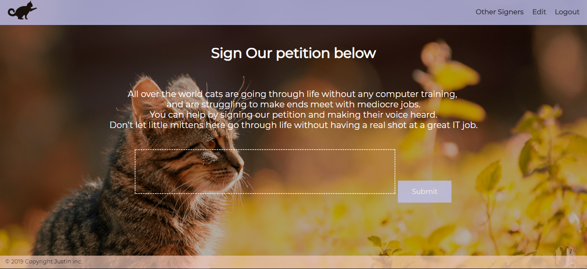

# Petition

The Petition is project in which users can log in or register on the site to sign a fake petition which
is petitioning for free computer lessons for cats.

The site is built using Express-Handlebars, database used is Postgres, and Vanilla Javascript for the Signature Canvas.

Log in and Registration are both protected with bcrypt pre entry to the database, therefore keeping users passwords safe in
the database.

Features on this website include, a Canvas where signers can digitally sign.
A page where users can edit their profiles.
A signers page where signers are listed and can be seperated by city.
And Signers can also delete their their signature from the database.

This project is served using Heroku, so it can viewed publicly.

https://computers-for-kittys.herokuapp.com/petition
